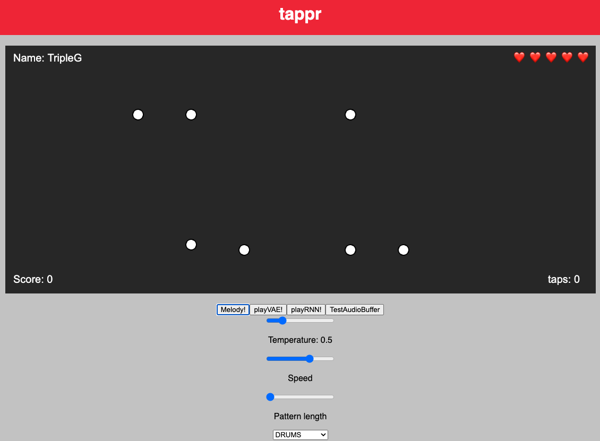

# React + Magenta.js

Experimenting with ; fiddling around with rhythm generation (ongoing)

## How to run the app

You need Node.js installed to run the application.

Clone or download the project from GitHub, change into the directory and install the dependencies.

```bash
git clone ***
cd ***
npm install
```

Start the application:

```bash
npm start
```

## Preview

Here's a quick preview of the tappr:



The basic idea is that the VAE generates a rhythm, which the player has to match. If he fails to do so 5x, the game ends. 

## References

This app was built using the following Node Modules:

*Tone.js
*Magenta.js
*React

Audio samples were partly taken from **_Deep House Drum Samples_**, produced by [Biochron](https://soundpacks.com/company/biochron/)
